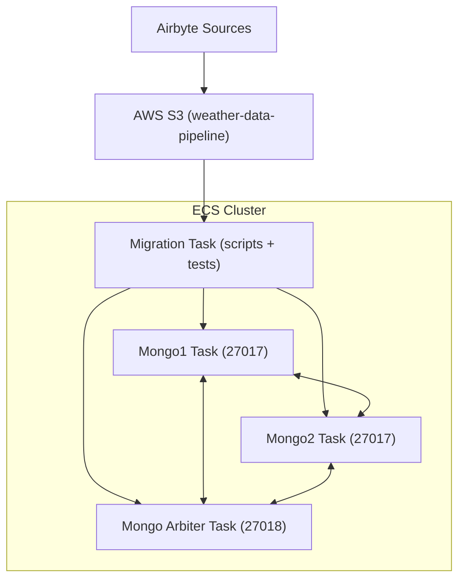

# 🚀 Weather data pipeline 

## 📌 Objectif
Ce projet automatise la migration et l’intégration de données météo provenant de plusieurs sources (JSON, Excel) vers une base **MongoDB Replica Set** hébergée sur AWS ECS.  
Les données sont normalisées, converties dans les bonnes unités et validées via des tests automatisés.

---

## 🛠️ Stack technique
- **Python 3.12** (pandas, pymongo, boto3, pytest)
- **MongoDB Replica Set** (déployé sur ECS/EC2)
- **AWS S3** (stockage des fichiers sources)
- **Airbyte** (ingestion des données vers S3)
- **Docker** (containerisation)
- **ECS Task Definition** (migration automatisée)
- **Pytest** (validation post-migration)

---

## 📂 Structure du repo

```
.
├── migration/
│   ├── Dockerfile            # Image de migration
│   ├── migration.py          # Script principal (orchestrateur)
│   ├── scriptjson.py         # Ingestion JSON depuis S3 (InfoClimat)
│   ├── scriptxls1.py         # Ingestion XLS (Ichtegem, BE)
│   ├── scriptxls2.py         # Ingestion XLS (La Madeleine, FR)
│   └── test_migration.py     # Tests Pytest (validation MongoDB)
└── infra/
    ├── mongo1-task.json
    ├── mongo2-task.json
    ├── mongo-arbiter-task.json
    └── migration-task.json
```

---

## 🌍 Sources de données (via Airbyte + S3)

Les données météo proviennent de **trois sources distinctes** collectées avec **Airbyte** et stockées dans un bucket **AWS S3** :

1. **Infoclimat (JSON)**  
   [Data_Source1_011024-071024.json](https://s3.eu-west-1.amazonaws.com/course.oc-static.com/projects/922_Data+Engineer/922_P8/Data_Source1_011024-071024.json)

2. **Weather Underground – Ichtegem, BE (Excel)**  
   [Weather Underground - Ichtegem, BE.xlsx](https://s3.eu-west-1.amazonaws.com/course.oc-static.com/projects/922_Data+Engineer/922_P8/Weather+Underground+-+Ichtegem%2C+BE.xlsx)

3. **Weather Underground – La Madeleine, FR (Excel)**  
   [Weather Underground - La Madeleine, FR.xlsx](https://s3.eu-west-1.amazonaws.com/course.oc-static.com/projects/922_Data+Engineer/922_P8/Weather+Underground+-+La+Madeleine%2C+FR.xlsx)

---

## ⚙️ Mise en place avec Airbyte

### 1. Installer Airbyte (Docker)
```bash
git clone https://github.com/airbytehq/airbyte.git
cd airbyte
./run-ab-platform.sh
```
Airbyte est ensuite disponible sur [http://localhost:8000](http://localhost:8000).

---

### 2. Créer les **connecteurs source**
Dans l’interface Airbyte :
- Source **HTTP/CSV/JSON** → pour le fichier JSON Infoclimat  
- Source **HTTP/Excel** → pour le fichier XLS d’Ichtegem  
- Source **HTTP/Excel** → pour le fichier XLS de La Madeleine  
👉 Utiliser directement les URLs ci-dessus comme endpoints.

---

### 3. Créer une **destination S3**
- Type : **Amazon S3**  
- Bucket : `weather-data-pipeline`  
- Format de sortie : `CSV` ou `Parquet` (ici `CSV`)  
- Dossiers cibles :  
  - `/infoclimat/`  
  - `/ichtegem/`  
  - `/lamadeleine/`

---

### 4. Synchroniser les données
Lancer une **Sync** dans Airbyte et vérifier que les fichiers apparaissent bien dans S3 :  
```
s3://weather-data-pipeline/infoclimat/
s3://weather-data-pipeline/ichtegem/
s3://weather-data-pipeline/lamadeleine/
```

---

### 5. Lancer la migration
Une fois les données présentes dans S3, exécutez la **Migration Task ECS** (voir section Déploiement ECS) qui :  
- Télécharge les fichiers depuis S3  
- Nettoie et transforme les données  
- Insère dans MongoDB  
- Valide avec Pytest  

---

## 🔧 Pré-requis

Avant de déployer sur AWS, assurez-vous d’avoir installé et configuré :

1. **AWS CLI v2**
   - Installation : https://docs.aws.amazon.com/cli/latest/userguide/getting-started-install.html
   - Vérification :
     ```bash
     aws --version
     ```

2. **Configuration des credentials**
   - Soit via `aws configure` :
     ```bash
     aws configure
     ```
     (renseignez **AWS Access Key**, **Secret Key**, **region** et **output format**)
   - Soit via des variables d’environnement :
     ```bash
     export AWS_ACCESS_KEY_ID=...
     export AWS_SECRET_ACCESS_KEY=...
     export AWS_DEFAULT_REGION=eu-west-3
     ```

3. **Docker** (pour builder et tester vos images localement)
   - Vérifiez avec :
     ```bash
     docker --version
     ```

4. **Python 3.12 + pip** (pour exécuter localement les scripts et tests si besoin)

---

## 🔍 Contenu et rôle de l’image `migration`

L’image Docker `lyut78/migration:latest` embarque l’ensemble des scripts nécessaires pour migrer et valider les données météo.  
Elle est orchestrée par le script `migration.py`, qui exécute les étapes suivantes :

1. **Vérification de la collection MongoDB**
   - Si la collection `weather` est vide → déclenche la migration.
   - Sinon → aucun traitement n’est lancé.

2. **Exécution des scripts de migration**
   - `scriptjson.py`  
     - Télécharge depuis S3 le fichier JSON Infoclimat  
     - Normalise et nettoie les données (types, NaN → None, conversion en datetime ISO)  
     - Sauvegarde un pickle `df_json.pkl`  
     - Insère les données dans MongoDB  

   - `scriptxls1.py`  
     - Télécharge depuis S3 le fichier Excel (Ichtegem, BE)  
     - Nettoie et convertit les unités (°F → °C, mph → km/h, in → mm)  
     - Ajoute les métadonnées station (id, latitude, longitude, etc.)  
     - Sauvegarde un pickle `df_xls1.pkl`  
     - Insère dans MongoDB  

   - `scriptxls2.py`  
     - Même logique que `scriptxls1.py` mais pour la station La Madeleine (FR).  
     - Génère le fichier `df_xls2.pkl`  
     - Insère dans MongoDB  

3. **Tests automatiques**
   - Lancement de `pytest test_migration.py`  
   - Vérifie que :  
     - Les colonnes insérées dans MongoDB correspondent exactement au schéma attendu  
     - Le nombre de documents insérés correspond au nombre de lignes des DataFrames pickle  

4. **Nettoyage**
   - Suppression automatique des fichiers temporaires `.pkl` après validation.

👉 L’image `migration` sert donc de **job one-shot** à exécuter sur ECS :  
elle importe les données depuis S3, les transforme, les charge dans MongoDB et valide leur qualité.

---

## ☁️ Déploiement MongoDB Replica Set + Migration sur AWS ECS

Le projet est conçu pour tourner sur **ECS/EC2** avec un Replica Set MongoDB.  
Quatre Task Definitions sont fournies dans `infra/` :

- `mongo1-task.json` → premier nœud MongoDB
- `mongo2-task.json` → second nœud MongoDB
- `mongo-arbiter-task.json` → arbitre pour le quorum du Replica Set
- `migration-task.json` → exécute la migration et les tests

---

### 1. Enregistrer les Task Definitions
```bash
aws ecs register-task-definition --cli-input-json file://infra/mongo1-task.json
aws ecs register-task-definition --cli-input-json file://infra/mongo2-task.json
aws ecs register-task-definition --cli-input-json file://infra/mongo-arbiter-task.json
aws ecs register-task-definition --cli-input-json file://infra/migration-task.json
```

---

### 2. Lancer les containers MongoDB
```bash
aws ecs run-task --cluster my-cluster --task-definition mongo1-task --launch-type EC2
aws ecs run-task --cluster my-cluster --task-definition mongo2-task --launch-type EC2
aws ecs run-task --cluster my-cluster --task-definition mongo-arbiter-task --launch-type EC2
```

⚠️ Vérifiez que chaque tâche a une IP dans le VPC et que le security group ouvre le port **27017/27018**.

---

### 3. Initialiser le Replica Set
Une fois les trois containers lancés, connectez-vous à `mongo1` et initialisez le Replica Set :

```bash
docker exec -it <mongo1-container-id> mongosh
```

Puis dans la console Mongo :
```javascript
rs.initiate({
  _id: "rs0",
  members: [
    { _id: 0, host: "mongo1.mongo.local:27017" },
    { _id: 1, host: "mongo2.mongo.local:27017" },
    { _id: 2, host: "mongo-arbiter.mongo.local:27018", arbiterOnly: true }
  ]
})
```

---

### 4. Lancer la migration
```bash
aws ecs run-task --cluster my-cluster --task-definition migration-task --launch-type EC2
```

👉 Cette tâche exécute :  
- `scriptjson.py`  
- `scriptxls1.py`  
- `scriptxls2.py`  
- `pytest test_migration.py`  

et supprime les fichiers pickle en sortie.

---

### 5. Logs & monitoring
- Les logs MongoDB → CloudWatch Logs group `/ecs/mongodb`
- Les logs migration → `/ecs/migration-task`


---

## 🔐 Test d’accès à MongoDB via SSH

Le projet inclut un script `test_mongo.py` permettant de calculer le temps d'accès à MongoDB sur une instance EC2 distante en utilisant une **clé SSH**.

### 1. Pré-requis
- Instance **EC2** avec MongoDB (`mongo:latest`) en cours d’exécution  
- Une **clé SSH privée** valide (`.pem`) associée à l’instance  
- Port **22** ouvert dans le **Security Group**  

### 2. Paramètres du script
- `user` → utilisateur SSH (par défaut : `ec2-user`)  
- `key_path` → chemin vers la clé privée (par défaut : `keyprojet7.pem`)  
- Le script demande l’**IP publique** de l’instance EC2 au lancement.

### 3. Exécution
```bash
python migration/test_mongo.py
```

Exemple :
```
 Entrez l'adresse IP publique de l'instance EC2 : 3.250.xxx.xxx
```

### 4. Fonctionnement
1. Connexion SSH à l’instance avec la clé  
2. Détection du conteneur `mongo:latest`  
3. Exécution d’une requête d’agrégation sur la base `weather` :
   - Filtre : `dh_utc >= 2024-01-01`, `pluie_1h` non nul, `temperature <= 35`  
   - Agrégation par `station_name`  
   - Retourne : nombre de mesures, moyenne pluie, min/max température  

### 5. Exemple de sortie
```
----  OUTPUT ----
[
  {
    "_id": "La Madeleine",
    "total_mesures": 140,
    "moyenne_pluie": 2.15,
    "min_temperature": 4,
    "max_temperature": 28
  },
  {
    "_id": "Ichtegem",
    "total_mesures": 120,
    "moyenne_pluie": 1.87,
    "min_temperature": 2,
    "max_temperature": 30
  }
]

⏱ Temps total d'accès à MongoDB : 3.42 secondes
```

---

## 📊 Schéma d’architecture


